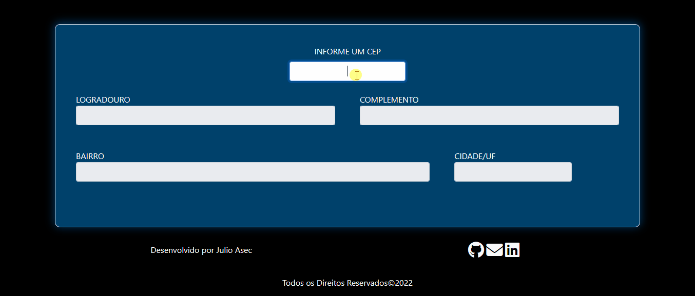
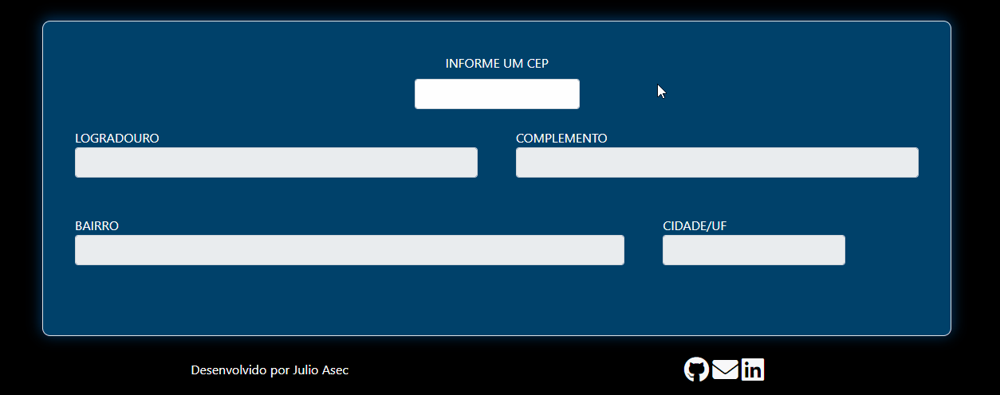

# ⭐ Consulta Cep

Faça consultas de endereço através de um CEP.  

# 📖 Instruções de Uso

### Pré Requisitos:

- [Git](https://git-scm.com/)
- [NodeJs](https://nodejs.org/en/)
- Um navegador. 
- [VSCode](https://code.visualstudio.com/)(Com a extensão [live server](https://marketplace.visualstudio.com/items?itemName=ritwickdey.LiveServer)).
  
 

Usando um terminal de sua preferência siga as instruções a seguir:

    # Clone o repositório na sua máquina:
    Git clone 

    # Entre na pasta do projeto:
    cd consulta-cep

    # Instale as dependências do projeto:
    npm install 

    # Gere o build na pasta Dist
    npm run prod

    # Execute o Live Server na pasta dist  
    
 

# ⚡ Funcionalidades 

- Consultar um endereço via número do cep.
- Copiar o endereço.

 

## Demonstração:

Digite um cep válido e clique fora da caixa. A aplicação irá completar seus respectivos campos:

  

Caso um cep inexistente ou fora do padrão seja informado, a aplicação informará:

  

Voce também pode copiar o conteúdo das caixas clicando sobre elas:

  
 

# 🚩 Sobre
    
## Técnologias Utilizadas:

- [HTML](https://developer.mozilla.org/pt-BR/docs/Web/HTML)  
- [CSS](https://www.w3schools.com/css/)
- [SASS](https://sass-lang.com/)
- [Javascript](https://developer.mozilla.org/pt-BR/docs/Web/JavaScript)
- [Axios](https://axios-http.com/ptbr/)
- [Gulp](https://gulpjs.com/) 
- [Git](https://git-scm.com/) 
- [NodeJs](https://nodejs.org/en/) (npm) 

## Editor de Código:
- [Vscode](https://code.visualstudio.com/)
  
# 🔎 Observações:
 
 - O Navegador bloqueia a requisição pra Api, pra impedir isso é necessário simular um servidor, a extensão Live Server supre isso.  
 - O módulo do cliente Axios utiliza o padrão CommonJs, que não é nativo do navegador. As soluções encontradas foram: usar um module bundler ou importar o cliente via tag script direto no arquivo html, a segunda opção foi a implementada.
 - Os plugins do babel e de concatenação geravam um erro. A variável "cep" é utilizada com frequência e por isso a transpilação pra ES5 gerava um erro causado pelo hoisting(já que o ES5 ainda não aceitava a declaração "let"). De acordo com o site caniuse o ES6 é suportado pela maioria dos navegadores, por isso foi decidido a não transpilação pra ES5.
 - Foi utilizado no projeto o paradigma orientado a objetos.
  
****
Criado por ***JULIO ASEC*** 👨🏾‍🦲
[Linkedin](https://www.linkedin.com/in/julio-silva-04b6aa224/) | [Github](https://github.com/Julioasec) | [ed_julio@outlook.com](mailto:ed_julio@outlook.com)